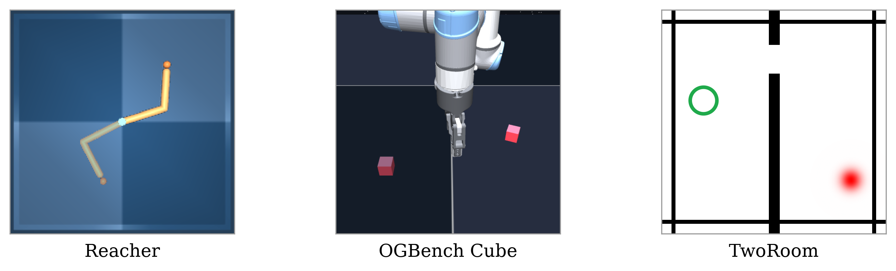

# rp1

rp1 is the reference implementation of RP1 from *Reinforcement Learned Planning with Latent World Models*.

On top of a frozen, pretrained latent world model, rp1 trains two things: a goal-conditioned quasimetric
value, and a planner network that refines an action plan by following that value's gradient through the
world model. At deployment the learned planner replaces sampling-based search (CEM, MPPI) and plain
gradient descent, and needs a small, fixed number of world-model rollouts per decision.



## Setup

Install [Git LFS](https://git-lfs.com/) and [Pixi](https://pixi.sh), then:

```bash
git lfs install
git clone <this repository> rp1 && cd rp1
git lfs pull
pixi install
```

Pixi provides Python, PyTorch (CUDA on Linux, CPU on Apple Silicon), MuJoCo and every other dependency.
On Linux GPU machines only the NVIDIA driver has to be installed on the host.

Datasets and latent caches go to `~/.cache/rp1`; set `RP1_DATA_HOME` to place them elsewhere.
W&B logging is off by default; `logging.wandb.mode=online` turns it on.

## What is in the box

The pretrained world models for every environment live in `assets/core/world_model/` (LeWM and PLDM, and
the Dyna-finetuned Cube models). The trained rp1 agents from the paper live in `assets/core/agent/`, each
seed's `planner.pt` next to the value it plans against. Built wheels include the configs but not these
assets.

## Commands

Every command composes a Hydra config, so any value can be overridden on the command line, and writes its
resolved config, log and outputs to a run directory under `logs/`.

```bash
pixi run prepare job=fetch_dataset preparation.dataset=ogb_cube    # download a registered dataset
pixi run pretrain                                                  # train a LeWM world model
pixi run posttrain training.wm=<world model> training.dataset=<dataset>   # train the rp1 agent
pixi run evaluate benchmark=cube_lewm                              # evaluate a policy
```

`pretrain --config-name phases/world_model/pldm` trains a PLDM world model instead of a LeWM one.

`posttrain` runs the full agent pipeline on a frozen world model: latent caching, action extraction, the
offline value, and actor-critic training of the planner. `training.stages=[value,planner]` reruns part of
it against existing caches, and `--config-name phases/agent/<phase>` runs a single phase instead, such
as the value alone (`metric`) or one of the DMPO and L2O baselines.

`evaluate` selects a benchmark (`configs/inference/benchmark/`) and a solver, policy and value from
`configs/core/agent/`. To evaluate a vendored agent:

```bash
pixi run evaluate benchmark=cube_lewm core/agent/solver=rp1 \
    core.agent.solver.checkpoint.path=assets/core/agent/cube/lewm/s0/planner.pt
```

The same benchmark runs the baselines with `core/agent/solver=cem`, `mppi` or `adam`, under the learned
value with `core/agent/value=metric core.agent.value.checkpoints=[<value>]`, and the no-move floor with
`core/agent/policy=no_move`. [docs/replication/REPLICATION.md](docs/replication/REPLICATION.md) maps
the paper's tables to these commands.

## Methods

A learned planning method is one package, `src/rp1/methods/<name>/` (`net.py`, `train.py`, `solver.py`),
configured by one directory, `configs/methods/<name>/` (`net.yaml`, `train.yaml`, `solver.yaml`). The agent
pipeline shares the cache and value stages across methods and hands the planner stage to the one selected:

```bash
pixi run posttrain training.method=rp1 training.wm=<world model> training.dataset=<dataset>
pixi run posttrain --config-name /methods/rp1/train training.cache=<cache> ...   # the method's trainer alone
pixi run evaluate benchmark=cube_lewm core/agent/solver=rp1 core.agent.solver.checkpoint.path=<planner.pt>
```

A new method starts as a copy of `methods/rp1` in both trees, plus a `configs/core/agent/solver/<name>.yaml`
that includes its `solver.yaml`.

## Development

```bash
pixi run -e dev hooks    # install the pre-commit hooks
pixi run -e dev check    # format check, lint, type check, tests
pixi run -e dev test-changed
```

`pixi run -e dev test-slow` runs the tests marked slow. CLAUDE.md states the style rules for the code.
The Stable-WM dependency is pinned; [docs/stable-worldmodel-compatibility.md](docs/stable-worldmodel-compatibility.md)
says why and what an upgrade involves.
